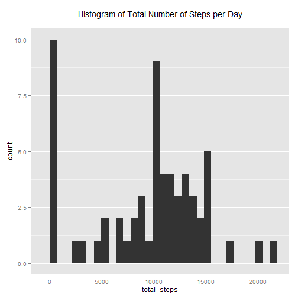
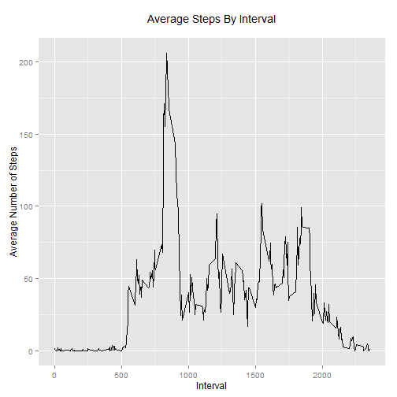
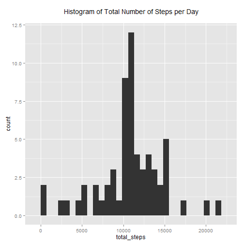
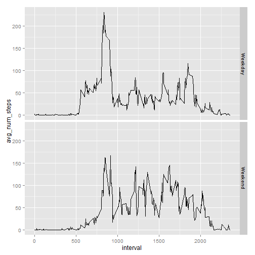

# Loading and Preprocessing the Data

I download the activity dataset from the link given by the assignment. I then unzip the file, and read it in. I also load required packages that will be used.


```r
library(ggplot2, quietly = T)
```

```
## Warning: package 'ggplot2' was built under R version 3.1.2
```

```r
library(data.table, quietly = T)
```

```
## Warning: package 'data.table' was built under R version 3.1.2
```

```
## data.table 1.9.4  For help type: ?data.table
## *** NB: by=.EACHI is now explicit. See README to restore previous behaviour.
```

```r
download.file("http://d396qusza40orc.cloudfront.net/repdata%2Fdata%2Factivity.zip",
              destfile = "activity.zip")

unzip("activity.zip")
```

The activity file was downloaded on 2015-02-14 13:43:54. I will use the data.table package to do the required calculations. 


```r
dat = read.csv("activity.csv")

dat = data.table(dat)
setkey(dat,date)
```

The dataset has the following format

```r
summary(dat)
```

```
##      steps                date          interval     
##  Min.   :  0.00   2012-10-01:  288   Min.   :   0.0  
##  1st Qu.:  0.00   2012-10-02:  288   1st Qu.: 588.8  
##  Median :  0.00   2012-10-03:  288   Median :1177.5  
##  Mean   : 37.38   2012-10-04:  288   Mean   :1177.5  
##  3rd Qu.: 12.00   2012-10-05:  288   3rd Qu.:1766.2  
##  Max.   :806.00   2012-10-06:  288   Max.   :2355.0  
##  NA's   :2304     (Other)   :15840
```

# Performing Calculations

## What is the Mean Total Number of Steps Taken Per Day?

Lets calculate the total number of steps taken per day

```r
totalstepsbyday = dat[,list("total_steps" = sum(steps,na.rm = T)), by = date]
```

Let's look at a histogram of the total number of steps per day.

```r
qplot(total_steps, data = totalstepsbyday, geom = "histogram",
      main = "Histogram of Total Number of Steps per Day\n")
```

```
## stat_bin: binwidth defaulted to range/30. Use 'binwidth = x' to adjust this.
```

 

Let's calculate the mean and the median of total number of steps per day.

```r
dat[,list("median number of steps per day" = median(steps,na.rm = T),
          "mean number of steps per day" = mean(steps,na.rm = T))]
```

```
##    median number of steps per day mean number of steps per day
## 1:                              0                      37.3826
```

## What is the Average Daily Activity Pattern

Lets explore the average number of steps taken, averaged accross all days.

```r
avgstepsperinterval = dat[,list("avg_steps_interval" = mean(steps, na.rm = T)), by = interval]

qplot(interval, avg_steps_interval, data = avgstepsperinterval, main = "Average Steps By Interval\n", xlab = "Interval", ylab = "Average Number of Steps", geom = c("line"))
```

 

The 835 interval has the has on average the maximum number of steps

```r
avgstepsperinterval[which(avg_steps_interval == max(avg_steps_interval)),]
```

```
##    interval avg_steps_interval
## 1:      835           206.1698
```

## Imputing Missing Values

The total number of missing values by each field is

```r
colSums(is.na(dat))
```

```
##    steps     date interval 
##     2304        0        0
```
This means there are 2304 rows out of 17568 that have missing data.

Will fill in those missing values for each data point by using the average number of steps for that interval.

```r
avgstepsperinterval = data.table(avgstepsperinterval)
setkey(avgstepsperinterval,interval)

imputeddat = copy(dat)
# missing values in steps
missingStepsData = is.na(imputeddat$steps)
# convert steps to double so that we can assign the mean to missing values
imputeddat[, steps := as.double(steps)]
```

```
##        steps       date interval
##     1:    NA 2012-10-01        0
##     2:    NA 2012-10-01        5
##     3:    NA 2012-10-01       10
##     4:    NA 2012-10-01       15
##     5:    NA 2012-10-01       20
##    ---                          
## 17564:    NA 2012-11-30     2335
## 17565:    NA 2012-11-30     2340
## 17566:    NA 2012-11-30     2345
## 17567:    NA 2012-11-30     2350
## 17568:    NA 2012-11-30     2355
```

```r
imputeddat[missingStepsData,steps := (avgstepsperinterval[.(interval),avg_steps_interval])]
```

```
##            steps       date interval
##     1: 1.7169811 2012-10-01        0
##     2: 0.3396226 2012-10-01        5
##     3: 0.1320755 2012-10-01       10
##     4: 0.1509434 2012-10-01       15
##     5: 0.0754717 2012-10-01       20
##    ---                              
## 17564: 4.6981132 2012-11-30     2335
## 17565: 3.3018868 2012-11-30     2340
## 17566: 0.6415094 2012-11-30     2345
## 17567: 0.2264151 2012-11-30     2350
## 17568: 1.0754717 2012-11-30     2355
```

```r
# A spot check for some values to ensure the assignment was correct

avgstepsperinterval[.(0)]
```

```
##    interval avg_steps_interval
## 1:        0           1.716981
```

```r
imputeddat[missingStepsData & interval == 0]
```

```
##       steps       date interval
## 1: 1.716981 2012-10-01        0
## 2: 1.716981 2012-10-08        0
## 3: 1.716981 2012-11-01        0
## 4: 1.716981 2012-11-04        0
## 5: 1.716981 2012-11-09        0
## 6: 1.716981 2012-11-10        0
## 7: 1.716981 2012-11-14        0
## 8: 1.716981 2012-11-30        0
```

```r
# interval 0 looks correct

avgstepsperinterval[.(35)]
```

```
##    interval avg_steps_interval
## 1:       35          0.8679245
```

```r
imputeddat[missingStepsData & interval == 35]
```

```
##        steps       date interval
## 1: 0.8679245 2012-10-01       35
## 2: 0.8679245 2012-10-08       35
## 3: 0.8679245 2012-11-01       35
## 4: 0.8679245 2012-11-04       35
## 5: 0.8679245 2012-11-09       35
## 6: 0.8679245 2012-11-10       35
## 7: 0.8679245 2012-11-14       35
## 8: 0.8679245 2012-11-30       35
```

```r
# interval 35 looks correct

avgstepsperinterval[.(20)]
```

```
##    interval avg_steps_interval
## 1:       20          0.0754717
```

```r
imputeddat[missingStepsData & interval == 20]
```

```
##        steps       date interval
## 1: 0.0754717 2012-10-01       20
## 2: 0.0754717 2012-10-08       20
## 3: 0.0754717 2012-11-01       20
## 4: 0.0754717 2012-11-04       20
## 5: 0.0754717 2012-11-09       20
## 6: 0.0754717 2012-11-10       20
## 7: 0.0754717 2012-11-14       20
## 8: 0.0754717 2012-11-30       20
```

```r
# interval 20 looks correct
```

Lets calculate the total number of steps taken per day after imputing missing values.

```r
imputedtotalstepsbyday = imputeddat[,list("total_steps" = sum(steps,na.rm = T)), by = date]
```

Let's look at a histogram of the total number of steps per day aftering imputing missing values.

```r
qplot(total_steps, data = imputedtotalstepsbyday, geom = "histogram",
      main = "Histogram of Total Number of Steps per Day\n")
```

```
## stat_bin: binwidth defaulted to range/30. Use 'binwidth = x' to adjust this.
```

 

Let's calculate the mean and the median of total number of steps per day after imputing missing values.

```r
imputeddat[,list("median number of steps per day" = median(steps,na.rm = T),
          "mean number of steps per day" = mean(steps,na.rm = T))]
```

```
##    median number of steps per day mean number of steps per day
## 1:                              0                      37.3826
```

## Are there Differences In Activity Patterns Between Weekdays and Weekends?

We will explore differences in activity patterns between weekdays and weekends. 

Start by creating a factor nothing whether a day is a weekday or weekend, and then plot the average number of steps taken per interval, on weekdays and weekends.


```r
imputeddat[,dayofweek := weekdays(as.Date(date))]
```

```
##            steps       date interval dayofweek
##     1: 1.7169811 2012-10-01        0    Monday
##     2: 0.3396226 2012-10-01        5    Monday
##     3: 0.1320755 2012-10-01       10    Monday
##     4: 0.1509434 2012-10-01       15    Monday
##     5: 0.0754717 2012-10-01       20    Monday
##    ---                                        
## 17564: 4.6981132 2012-11-30     2335    Friday
## 17565: 3.3018868 2012-11-30     2340    Friday
## 17566: 0.6415094 2012-11-30     2345    Friday
## 17567: 0.2264151 2012-11-30     2350    Friday
## 17568: 1.0754717 2012-11-30     2355    Friday
```

```r
imputeddat[, type := factor(dayofweek == "Saturday" | dayofweek == "Sunday", labels = c("Weekday","Weekend"))]
```

```
##            steps       date interval dayofweek    type
##     1: 1.7169811 2012-10-01        0    Monday Weekday
##     2: 0.3396226 2012-10-01        5    Monday Weekday
##     3: 0.1320755 2012-10-01       10    Monday Weekday
##     4: 0.1509434 2012-10-01       15    Monday Weekday
##     5: 0.0754717 2012-10-01       20    Monday Weekday
##    ---                                                
## 17564: 4.6981132 2012-11-30     2335    Friday Weekday
## 17565: 3.3018868 2012-11-30     2340    Friday Weekday
## 17566: 0.6415094 2012-11-30     2345    Friday Weekday
## 17567: 0.2264151 2012-11-30     2350    Friday Weekday
## 17568: 1.0754717 2012-11-30     2355    Friday Weekday
```

```r
imputedavgnumstepsbydaytype = imputeddat[,.("avg_num_steps" = mean(steps, na.rm = T)), keyby = .(type, interval)]

qplot(x = interval, y = avg_num_steps, data = imputedavgnumstepsbydaytype, facets = type ~ ., geom = "line")
```

 
